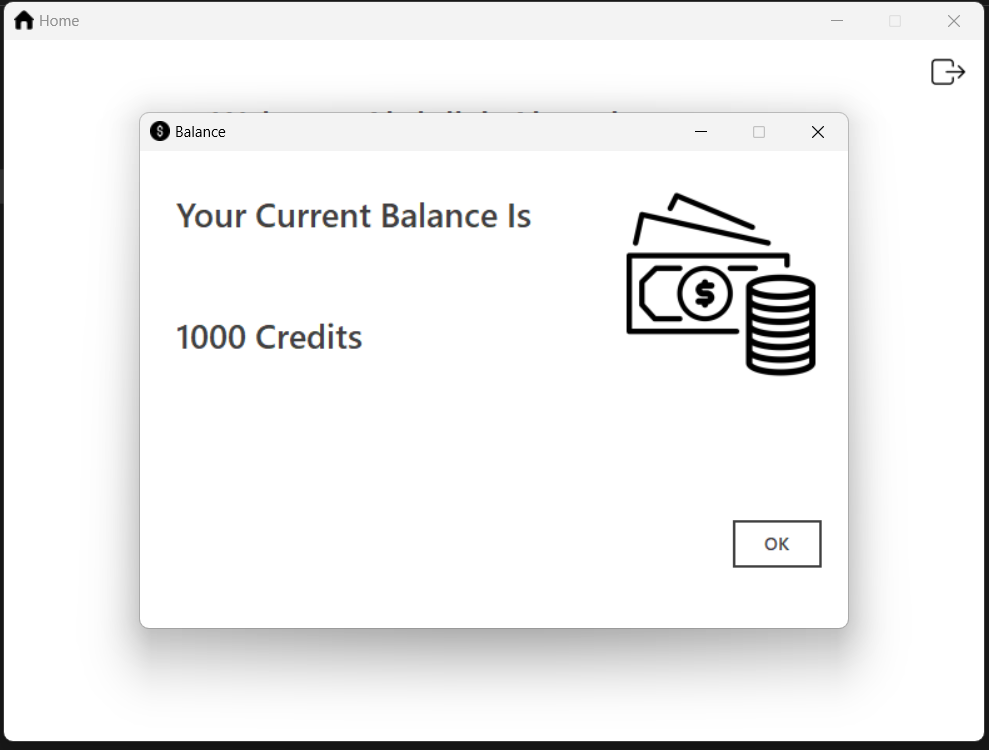

# Banking App in C# with GUI
This application was developed as a project for Fundamentals of Programming course. It demonstrates the concepts of programming I learned. 
Although the course did not cover Object Oriented Programming, I managed to include classes in the project for my own learning. These classes were written for managing accounts created by users, accessing database and displaying error messages.
# App Features
The app has the capabilities of creating new accounts, performing various transactions such as deposits, withdrawals, inter bank transfers, account statement, and resetting password in case the user forgets it.
# Graphical User Interface
The GUI was designed in Microsoft Visual Studio with the provided Desktop Application Framework. The GUI was easier to design as compared to other web frameworks as Microsoft's framework provides drag-and-drop features for UI design.
# Database
I made use of Microsoft's Local SQL Database as it can be easily integrated with applications developed using C# and Dot Net framework. Only one table was used for storing user information such as their names, emails, passwords, and balance.

